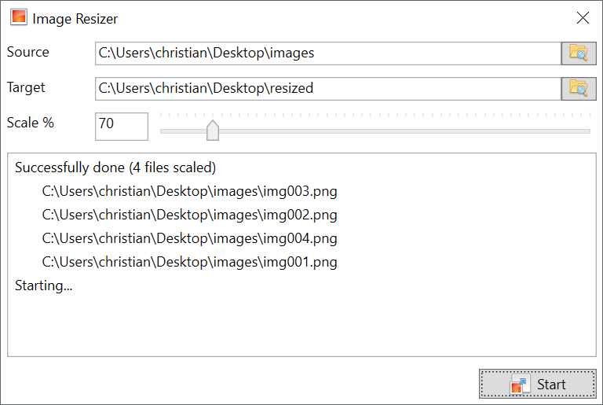

# .NET
These tools are based on the .NET Framework.

Here is an overview:

 - [Image Resizer](#image-resizer)

## Image Resizer
One of my wife's friends wanted to resize a huge collection of her wedding photos.
Doint this one by one (without any special tools) can be really timeconsuming.
Therefore I offered my help and created this tool for her.

It does what it says - it simply resizes all images inside a given folder and resizes them.
Supported file formats are: JPG, JPEG, BMP, PNG, GIF, TIFF

Keep in mind that this is one of the older tools I've created.
So the code might not be up to my current experience level and I probably do things differently now. That's the joy of learning. :)

[Link](image-resizer)

### Requirements
 - .NET Framework (4.8)
 
### Usage
Using this tool is pretty straightforward.
Note that the original files are never touched - so don't worry about loosing your originals.

 1. Simply choose a source folder containing the images you want to resize
 2. Now choose a target folder where the resized images should be copied
 3. Then choose your desired scaling percentage and click Start

